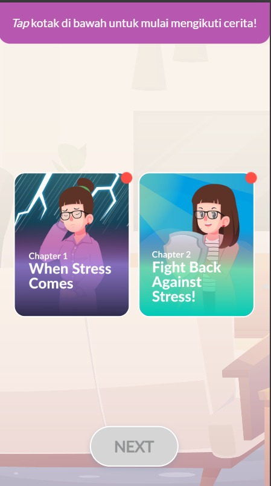
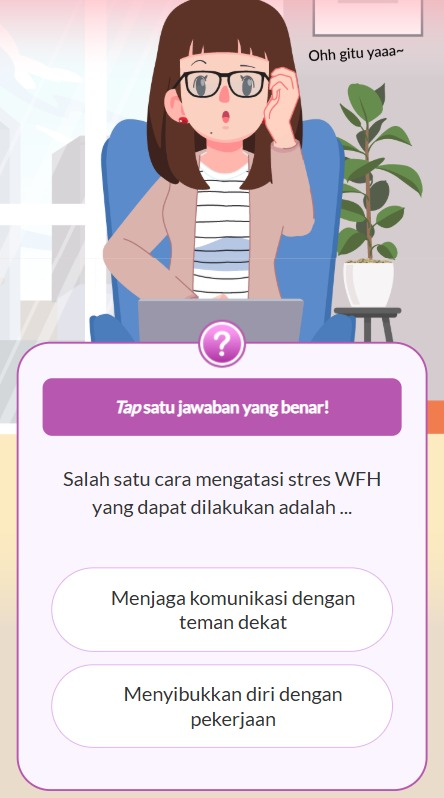

# Digital Comic — Interactive Learning Content

Digital Comic is an interactive learning content format designed to help learners understand information through a story-driven comic experience. This content type is ideal for presenting simple concepts, data, or knowledge in a visual and narrative format.

Learners progress through a comic-style storyline and may encounter **mini-quizzes** that must be answered correctly to continue, encouraging active engagement rather than passive reading.

---

## ✨ Key Features

- **Story-based learning** delivered in comic format  
- **Interactive panel navigation**  
- **Optional mini quizzes** to check understanding  
- **Progressive flow** — quizzes must be answered to move forward  
- **Lightweight and fast** — built with vanilla JS, jQuery, HTML, SCSS  
- **Smooth animations** with AOS.js  
- **Flexible JSON-based content structure**  

---

## 🔎 Preview




## 🧰 Tech Stack

| Technology | Description |
|-----------|-------------|
| **HTML5** | Base structure of the comic content |
| **SCSS** | Styling with modular, maintainable structure |
| **Vanilla JavaScript** | Main logic and interactions |
| **jQuery** | DOM manipulation and event handling |
| **JSON** | Story and quiz configuration |
| **AOS.js** | Scroll and animation effects |

---

## 🚀 Getting Started

### Clone the repository
```
git clone <repository-url>
```

## Run the project
```
index.html
```

## 📦 Content Configuration (JSON Example)
```
{
	"settings":{
		"next_slide":0
	},
	"list_bg":[
		{
			"chapter":1,
			"audio":"BGM_Chapter1.mp3",
			"data":[
				{
					"background":"Part-1-BG_v02.png",
					"list_box":[
						{
							"image":"Part 1 Aset 1.png",
							"fade":"right",
							"position":{
								"width":"100%",
								"top":"15%",
								"opacity":"1"
							}
						},
						{
							"image":"Part 1 Aset 2.png",
							"fade":"left",
							"position":{
								"width":"78%",
								"top":"24%",
								"opacity":"1"
							}
						}
					]
				}
			]
		}
	]
}
```

## 🖱️ How It Works
1. JSON content is loaded dynamically into the interface.
2. Each comic scene appears with AOS animations.
3. Scenes that contain quizzes require the learner to answer correctly to proceed.
4. The navigation continues through the storyline until the end.

## 📚 Use Cases

* Micro-learning modules
* Scenario-based learning
* Corporate training
* E-learning platforms
* Awareness and educational campaigns

## 🛠 Development Notes

* Designed without heavy frameworks for maximum portability
* Fully customizable story flow and quizzes
* Easy to integrate into LMS or standalone e-learning websites
* SCSS can be compiled using any preferred compiler or workflow